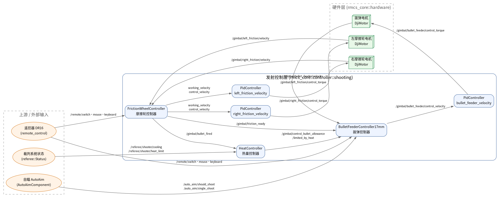
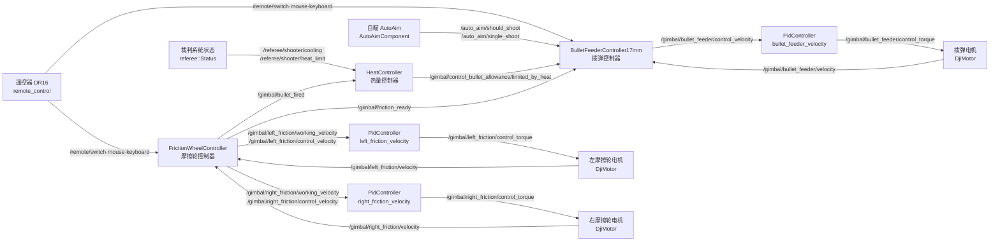
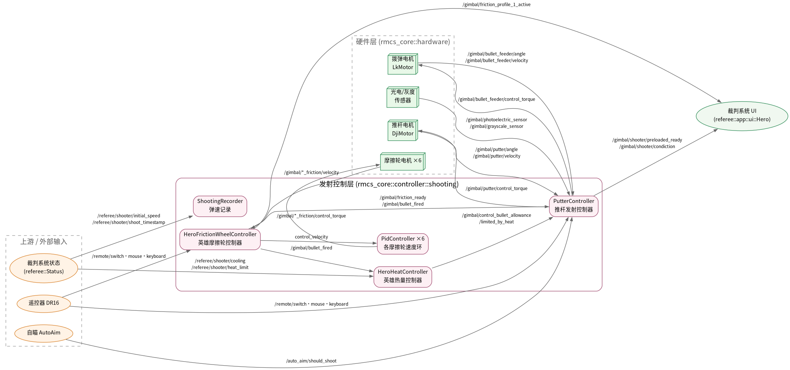
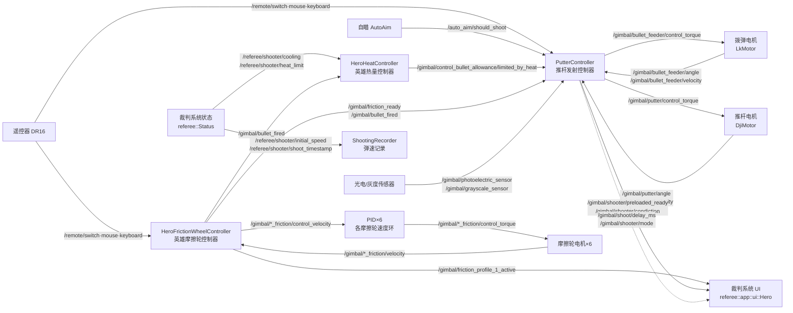

# 发射机构（Shooting）组件关系梳理

> 任务一：梳理发射机构（shooting）中的各组件关系图。
> 本文基于 `rmcs_core/src/controller/shooting/` 源码与 `rmcs_bringup/config/*.yaml` 配置整理，覆盖当前仓库所有在用方案。

## 1. 概述

发射机构是 RMCS 中负责“拨弹上膛 → 摩擦轮加速 → 子弹出膛 → 热量管控 / 卡弹保护”的子系统。
它运行在 `rmcs_executor` 的单线程数据流框架内（默认 `update_rate: 1000.0`）：

- 每个控制器都是一个 `Component`，通过命名端口（形如 `/gimbal/bullet_feeder/velocity`）耦合；
- `register_output` 生产数据、`register_input` 消费数据；
- 执行器启动时按端口依赖做拓扑排序，生成无环更新顺序（存在循环依赖会直接报错）。

按弹丸口径，仓库中存在两套实现：

| 方案 | 适用车型 | 摩擦轮控制 | 热量控制 | 拨弹/发射控制 |
|------|----------|-----------|----------|---------------|
| 17mm 方案 | 哨兵 `sentry.yaml`、步兵 `omni-infantry.yaml` / `deformable-infantry-omni(-b).yaml`、飞行器 `flight.yaml` | `FrictionWheelController` | `HeatController` | `BulletFeederController17mm` |
| 42mm 英雄方案 | 英雄 `steering-hero-little-six-friction.yaml` | `HeroFrictionWheelController` | `HeroHeatController` | `PutterController`（推杆式） |

> 另有 `BulletFeederController42mm`（旋转拨盘式 42mm 拨弹），目前未在任何在用配置中启用，属于历史/备用实现，本文仅作备注。

### 通用上下游

所有方案共享以下数据来源与去向：

- **遥控器**（DR16 `remote_control` 设备）：`/remote/switch/left`、`/remote/switch/right`、`/remote/mouse`、`/remote/keyboard`
- **裁判系统**（`referee::Status`）：`/referee/shooter/cooling`、`/referee/shooter/heat_limit`（以及英雄方案用到的 `/referee/shooter/initial_speed`、`/referee/shooter/shoot_timestamp`）
- **自瞄**（rmcs_auto_aim_v2 `AutoAimComponent`）：`/auto_aim/should_shoot`、`/auto_aim/single_shoot`
- **下游 UI**（`referee::app::ui::*`）：展示 `/gimbal/control_bullet_allowance/limited_by_heat`、`/gimbal/friction_profile_1_active`、`/gimbal/shooter/preloaded_ready`、`/gimbal/{摩擦轮}/working_velocity` 等

---

## 2. 17mm 方案关系图

组件：`FrictionWheelController`、`HeatController`、`BulletFeederController17mm`、摩擦轮速度 PID×2、拨弹速度 PID×1，以及硬件层摩擦轮电机×2、拨弹电机×1。

数据流说明：

1. **摩擦轮链路（速度闭环）**：`FrictionWheelController` 读取遥控器（`V` 键 / 拨杆切换）使能摩擦轮，经软起停斜坡生成每个摩擦轮的目标速度 `control_velocity`（并输出 `working_velocity` 供 UI 显示）；各摩擦轮 `PidController` 以 `/gimbal/{轮}/velocity` 为反馈、`control_velocity` 为给定，输出 `control_torque` 驱动电机。
2. **就绪与出膛检测**：`FrictionWheelController` 依据 6 个（英雄）/2 个（17mm）摩擦轮实际转速判断 `friction_ready`；通过主摩擦轮转速跌落积分检测子弹出膛，发布 `/gimbal/bullet_fired`。
3. **热量管控**：`HeatController` 以裁判系统冷却值/热量上限估计当前热量，输出“受热量限制的可用弹量” `control_bullet_allowance/limited_by_heat`。
4. **拨弹链路（速度环）**：`BulletFeederController17mm` 综合 `friction_ready`、出膛信号、热量余量、遥控器/自瞄触发信号，输出拨弹目标速度 `control_velocity`（连发/单发/卡弹反转保护）；`bullet_feeder_velocity_pid_controller` 完成速度闭环输出 `control_torque`。

---

## 3. 42mm 英雄方案关系图

组件：`HeroFrictionWheelController`、`HeroHeatController`、`PutterController`、6× 摩擦轮速度 PID、`ShootingRecorder`，硬件层含拨弹电机（LkMotor）、推杆电机（DjiMotor）、6 个摩擦轮电机、光电/灰度传感器。

数据流说明：

1. **摩擦轮链路（双档位）**：`HeroFrictionWheelController` 支持两组速度配置（`friction_velocities_profile_0/1`，`F` / `Ctrl+F` 切换），发布 `/gimbal/friction_profile_1_active` 供 UI 显示当前档位；其余机制与 17mm 一致（软起停、就绪、卡弹、出膛检测）。
2. **热量管控**：`HeroHeatController` 在 `bullet_fired` 上升沿累加热量，输出热量余量与 `/shoot/heat`。
3. **推杆发射链路（位置/速度混合）**：`PutterController` 同时驱动拨弹电机与推杆电机：
   - 拨弹电机按角度推进（`PRELOADING → PRELOADED → SHOOTING` 状态机），通过**光电传感器**确认子弹上膛，通过堵转/锁定检测判断完成与卡弹；
   - 推杆电机负责推弹出膛与复位（小保持力矩防下滑）；
   - 出膛判定来源包括摩擦轮转速跌落与推杆堵转，超时保护自动进入下一发。
4. **弹速记录**：`ShootingRecorder` 订阅裁判系统 `initial_speed` / `shoot_timestamp`，对摩擦轮出膛初速做统计（均值/极差/优良率）并写日志。

---

## 4. 组件端口清单

### 4.1 FrictionWheelController（17mm）/ HeroFrictionWheelController（42mm）

| 方向 | 端口 | 类型 | 说明 |
|------|------|------|------|
| 输入 | `/remote/switch/left` `/remote/switch/right` | `Switch` | 遥控器拨杆 |
| 输入 | `/remote/keyboard`（英雄另有 `/remote/mouse`） | `Keyboard`/`Mouse` | 使能/档位切换 |
| 输入 | `/gimbal/{摩擦轮}/velocity` | `double` | 各摩擦轮实际转速 |
| 输出 | `/gimbal/{摩擦轮}/working_velocity` | `double` | 目标转速（UI 显示） |
| 输出 | `/gimbal/{摩擦轮}/control_velocity` | `double` | 速度环给定 |
| 输出 | `/gimbal/friction_ready` | `bool` | 摩擦轮就绪 |
| 输出 | `/gimbal/friction_jammed` | `bool` | 摩擦轮卡死 |
| 输出 | `/gimbal/bullet_fired` | `bool` | 检测到出膛 |
| 输出 | `/gimbal/friction_profile_1_active`（英雄） | `bool` | 高档位是否激活 |

### 4.2 HeatController / HeroHeatController

| 方向 | 端口 | 类型 | 说明 |
|------|------|------|------|
| 输入 | `/referee/shooter/cooling` | `int64` | 每秒冷却值 |
| 输入 | `/referee/shooter/heat_limit` | `int64` | 热量上限 |
| 输入 | `/gimbal/bullet_fired` | `bool` | 出膛信号（累加热量） |
| 输出 | `/gimbal/control_bullet_allowance/limited_by_heat` | `int64` | 受热量限制的可用弹量 |
| 输出 | `/shoot/heat`（英雄） | `double` | 当前热量估计 |

### 4.3 BulletFeederController17mm

| 方向 | 端口 | 类型 | 说明 |
|------|------|------|------|
| 输入 | `/remote/switch/left` `/remote/switch/right` `/remote/mouse` `/remote/keyboard` | - | 手动触发 |
| 输入 | `/auto_aim/should_shoot` `/auto_aim/single_shoot` | `bool` | 自瞄连发/单发（可选输入） |
| 输入 | `/gimbal/friction_ready` | `bool` | 摩擦轮就绪 |
| 输入 | `/gimbal/bullet_fired` | `bool` | 出膛信号（结束单发窗口） |
| 输入 | `/gimbal/control_bullet_allowance/limited_by_heat` | `int64` | 热量余量 |
| 输入 | `/gimbal/bullet_feeder/velocity` | `double` | 拨弹电机实际转速 |
| 输出 | `/gimbal/bullet_feeder/control_velocity` | `double` | 拨弹目标速度 |
| 输出 | `/gimbal/shooter/mode` | `ShootMode` | 发射模式（AUTOMATIC/SINGLE…） |

### 4.4 PutterController（英雄）

| 方向 | 端口 | 类型 | 说明 |
|------|------|------|------|
| 输入 | `/remote/switch/left` `/remote/switch/right` `/remote/mouse` `/remote/keyboard` | - | 手动触发 |
| 输入 | `/auto_aim/should_shoot` | `bool` | 自瞄开火（可选输入） |
| 输入 | `/gimbal/friction_ready` `/gimbal/bullet_fired` | `bool` | 就绪/出膛 |
| 输入 | `/gimbal/control_bullet_allowance/limited_by_heat` | `int64` | 热量余量 |
| 输入 | `/gimbal/bullet_feeder/angle` `/gimbal/bullet_feeder/velocity` | `double` | 拨弹电机状态 |
| 输入 | `/gimbal/putter/angle` `/gimbal/putter/velocity` | `double` | 推杆电机状态 |
| 输入 | `/gimbal/photoelectric_sensor` `/gimbal/grayscale_sensor` | `bool` | 上膛检测传感器 |
| 输出 | `/gimbal/bullet_feeder/control_torque` | `double` | 拨弹电机力矩 |
| 输出 | `/gimbal/putter/control_torque` | `double` | 推杆电机力矩 |
| 输出 | `/gimbal/shoot/delay_ms` `/gimbal/shooter/mode` `/gimbal/shooter/condiction` `/gimbal/shooter/preloaded_ready` | - | 发射状态/供 UI 与调试 |

### 4.5 ShootingRecorder（英雄）

| 方向 | 端口 | 类型 | 说明 |
|------|------|------|------|
| 输入 | `/referee/shooter/initial_speed` | `float` | 出膛初速 |
| 输入 | `/referee/shooter/shoot_timestamp` | `double` | 出膛时间戳（触发记录） |

---

## 5. 执行顺序与关键约束

1. **拓扑排序**：执行器按端口依赖确定更新顺序，发射机构整体位于“硬件状态采集 → 控制器计算 → 控制指令下发”的链路中；`/auto_aim/*`、`/referee/*` 为上游。
2. **可选输入**：`/auto_aim/should_shoot`、`/auto_aim/single_shoot` 在未连接时由 `before_updating()` 中 `bind_directly(false)` 兜底，保证无自瞄也能手动射击。
3. **安全链**：任何方案都必须 `friction_ready` 且热量余量 > 0 才允许出弹；拨弹/推杆控制器均有卡弹反转保护与超时保护。
4. **同一话题、不同配置**：`/gimbal/friction_ready`、`/gimbal/bullet_fired` 等由摩擦轮控制器产生、被拨弹/推杆与热量控制器消费；每台车只启用一套方案，因此不存在多生产者冲突。

---

*资料来源：`rmcs_ws/src/rmcs_core/src/controller/shooting/`、`rmcs_ws/src/rmcs_core/src/hardware/`、`rmcs_ws/src/rmcs_bringup/config/*.yaml`、`rmcs_ws/src/rmcs_auto_aim_v2/src/`。*
