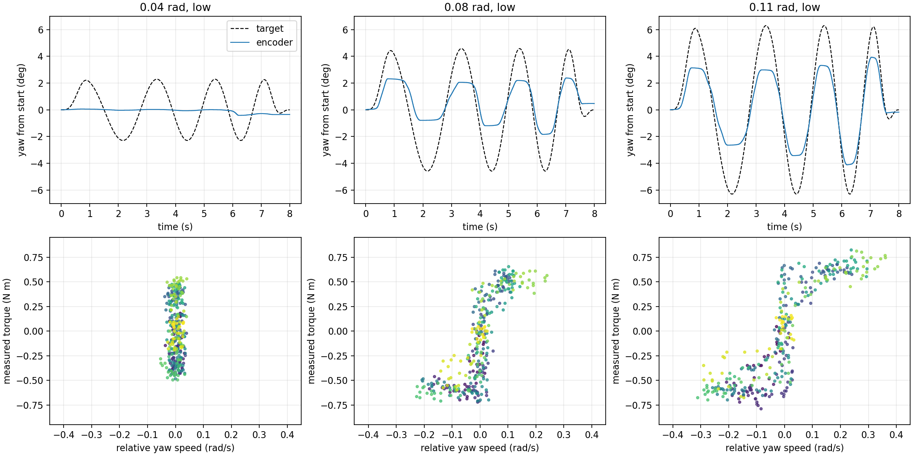
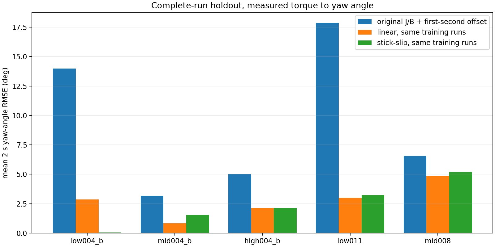
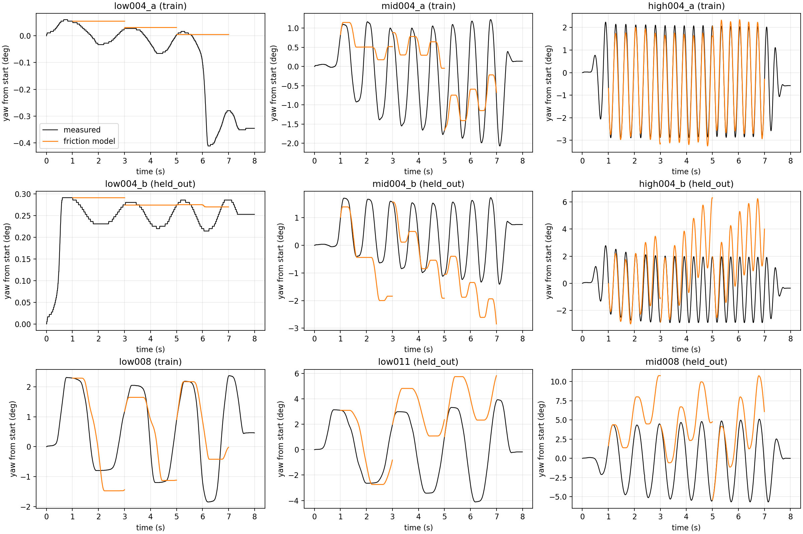

# C 车 yaw 云台跨频率建模与留出验证（2026-10-06）

## 结论

原来的线性二阶模型对高频运动仍有解释力，但不能直接覆盖低频起动和换向。低频 0.04 rad 指令下云台几乎不动，而电机测得力矩仍在约 ±0.55 N·m 内变化；把指令增大到 0.08、0.11 rad 后才出现明显运动。这是静摩擦／粘滞区的证据，不能仅靠重新调整惯量和线性阻尼解释。

本次拟合了一个**候选**二阶粘滑模型，并用整轮未参与拟合的数据验证。它比原模型明显改善低频弱激励，但在 0.11 rad 低频、0.08 rad 中频和部分高频重复中仍有 2–5° 的两秒角度预测误差，量级接近测试轨迹幅度；和用相同训练数据拟合的线性模型相比，5 个留出轮次中有 3 个更差。因此**尚不能把它称为已经验证的低频、高频通用模型，也不应把这些新参数写入当前控制器前馈**。原高频惯量估计仍可保留作局部模型。

## 实车测试

机器人临时切换到本仓库的 C 车云台测试程序，使用同一测得电机力矩作为模型输入，编码器相对 yaw 角为输出，陀螺仪差值为相对角速度。每轮扫频 8 s；程序限制力矩 3 N·m、相对起点角度 0.18 rad、速度 1.2 rad/s，并要求遥控门控就绪。最初两次预检因遥控器拿错而读到 `right_switch=0`，没有触发运动；改用正确遥控器后完成下表的 9 轮。每轮均完整运行，最大命令力矩 2.528 N·m、最大电机速度 0.988 rad/s、最大相对位移 0.099 rad，均未触及运动限制。

| CSV | 幅度 rad | 频率 Hz | 起点角 rad | 最大实际位移 rad | 用途 |
|---|---:|---:|---:|---:|---|
| [01_low_004.csv](../cross_frequency_2026-10-06/01_low_004.csv) | 0.04 | 0.30–0.65 | 4.721 | 0.0072 | 训练 |
| [02_mid_004.csv](../cross_frequency_2026-10-06/02_mid_004.csv) | 0.04 | 1.00–1.50 | 4.707 | 0.0361 | 训练 |
| [03_high_004.csv](../cross_frequency_2026-10-06/03_high_004.csv) | 0.04 | 2.50–3.00 | 4.702 | 0.0505 | 训练 |
| [04_low_004_repeat.csv](../cross_frequency_2026-10-06/04_low_004_repeat.csv) | 0.04 | 0.30–0.65 | 4.666 | 0.0052 | 留出 |
| [05_mid_004_repeat.csv](../cross_frequency_2026-10-06/05_mid_004_repeat.csv) | 0.04 | 1.00–1.50 | 4.647 | 0.0302 | 留出 |
| [01_high_004_repeat.csv](../cross_frequency_followup_2026-10-06/01_high_004_repeat.csv) | 0.04 | 2.50–3.00 | 4.608 | 0.0508 | 留出 |
| [02_low_008.csv](../cross_frequency_followup_2026-10-06/02_low_008.csv) | 0.08 | 0.30–0.65 | 4.540 | 0.0416 | 训练 |
| [03_low_011.csv](../cross_frequency_followup_2026-10-06/03_low_011.csv) | 0.11 | 0.30–0.65 | 4.538 | 0.0718 | 留出 |
| [04_mid_008.csv](../cross_frequency_followup_2026-10-06/04_mid_008.csv) | 0.08 | 1.00–1.50 | 4.399 | 0.0991 | 留出 |

图 1 显示低频幅度递增时的角度和力矩—速度关系。左侧 0.04 rad 轮次的转速接近零，电机力矩却跨过正负多个数值；这也解释了为什么从高频数据拟合出的线性模型在低频会虚构运动。

## 模型与拟合

原模型保持为

\[
J\ddot q+B\dot q+d=\tau_{\mathrm{meas}}(t-0.003),\quad
J=0.14261\ {\rm kg\,m^2},\ B=1.37855\ {\rm N\,m\,s/rad}.
\]

候选模型采用相同的两个机械状态 \(q,\dot q\)：

\[
J\ddot q=\tau_{\mathrm{meas}}(t-0.003)-B\dot q-F_c\operatorname{sgn}(\dot q)-K(q-4.55)-d.
\]

当 \(|\dot q|<0.006\ {\rm rad/s}\) 且扣除位置负载后的净力矩不超过 \(F_s\) 时，模型令速度为零，表示粘住；脱离后使用动摩擦 \(F_c\)。惯量 \(J\) 固定为先前直接力矩实验的估计，避免用弱低频数据重估惯量。其余参数仅用表中 4 个训练轮次的**完整记录**，按每轮同等权重、2 s 滚动角度与速度预测误差搜索；没有从留出轮次回填偏置。

| 参数 | 候选估计 | 单位 |
|---|---:|---|
| \(J\) | 0.14261（固定） | kg·m² |
| \(B\) | 0.500 | N·m·s/rad |
| \(F_c\) | 0.5375 | N·m |
| \(F_s\) | 0.5658 | N·m |
| \(K\) | 0.425 | N·m/rad |
| \(d\) | −0.0075 | N·m |

这些数值是**探索性拟合结果**。逐次删去一个训练轮次重拟合时，\(B\) 变化约 0.50–0.94，\(F_c\) 约 0.39–0.55 N·m，\(F_s\) 约 0.57–0.67 N·m；目前数据不足以稳定地区分动摩擦、静摩擦和位置负载。两轮高频记录分别单独用线性加速度回归时，\(J\) 约为 0.142、0.147 kg·m²，和原直接力矩实验的 0.14261 接近。

## 整轮留出对比

每轮只在 1–3、3–5、5–7 s 三个窗口开始时使用实测角度、速度作初始状态，随后由实测电机力矩**开环预测 2 s**，下表取三个窗口角度 RMSE 的平均值。比较对象为：（1）原来固定的 \(J,B\)，每轮仅用第 1 秒估计常值扰动；（2）与候选模型使用完全相同训练轮次、损失函数拟合的线性模型；（3）候选粘滑模型。第二项的拟合 \(B=2.954\) N·m·s/rad，明显偏离高频直接力矩估计，说明线性阻尼正在吸收摩擦效应。

| 留出轮次 | 原模型 ° | 同训练线性模型 ° | 候选粘滑模型 ° |
|---|---:|---:|---:|
| low004_b | 14.00 | 2.85 | **0.04** |
| mid004_b | 3.18 | **0.84** | 1.54 |
| high004_b | 5.01 | **2.12** | 2.13 |
| low011 | 17.87 | **2.98** | 3.23 |
| mid008 | 6.55 | **4.84** | 5.19 |
| **平均** | **9.32** | **2.73** | **2.42** |

候选模型平均误差改善的主要贡献来自几乎不动的 `low004_b`；在其余四轮中并没有稳定优势。尤其 `mid008` 的 5.19° 误差已超过 0.08 rad 指令对应的 4.58° 幅度，不能据此宣称跨幅度预测成功。图 2 展示全部留出轮次，图 3 展示每轮的实测角度与候选模型短窗口预测。

## 误差来源和适用边界

1. **起点不完全一致。** 九轮起点编码器角由 4.721 变化到 4.399 rad，跨度 0.322 rad。主测试和补测都因预设的同起点阈值超出而停止继续加测；这限制了位置负载参数的辨识，也限制了“同条件重复”的严格程度。起点变化是相对角编码器记录，不能仅凭它断定底盘姿态变化的全部来源。
2. **不是单纯的 IMU／编码器不一致。** 对每个 2 s 窗口积分相对 IMU 速度，与编码器角比较，其平均 RMSE 为 0.09–0.16°，低于数度的模型预测误差。
3. **低频明显依赖幅度和历史状态。** 相同低频范围下，0.04 rad 基本粘住，0.08/0.11 rad 出现不同幅度的运动。当前两状态、常参数粘滑近似能表达“粘住”，但对脱离、换向和负载偏置仍不足。4 个训练轮次也不足以可靠地区分静摩擦、动摩擦、角度负载与未记录的摩擦内部状态。

因此，目前可复用的结论是：**原 \(J\) 在高频仍近似成立；线性 \(B\) 只在原辨识工况有效；低频需加入摩擦／死区或带内部状态的摩擦模型。** 候选 \(F_c,F_s,K,d\) 不宜作为已校准的控制器前馈参数。

## 要得到可交付的通用模型，还缺什么

保持每轮相同的起始相对角并记录底盘姿态；在该角度分别做多周期定频 0.3、0.5、1.0、1.5、2.5、3.0 Hz，幅度覆盖起动阈值两侧，另在第二个角度重复。需要留出每个频段、幅度和角度的独立整轮数据，先固定验收门槛，再比较含内部摩擦状态（如预滑移／LuGre）与简单粘滑模型。特别要检查 0.08 rad 中频和 0.11 rad 低频的 2 s 开环误差是否明显小于指令幅度。未达到这个门槛前，维持当前控制器参数和既有高频局部模型。

## 文件和复现

- [主测试 protocol](../cross_frequency_2026-10-06/protocol.json)、[主测试 manifest](../cross_frequency_2026-10-06/manifest.json)；[补测 protocol](../cross_frequency_followup_2026-10-06/protocol.json)、[补测 manifest](../cross_frequency_followup_2026-10-06/manifest.json)。
- [全部模型参数与逐轮结果](fit.json)、[逐轮指标 CSV](run_metrics.csv)。
- [测试采集脚本](../run_cross_frequency_chirp.py)、[拟合和作图脚本](../fit_cross_frequency_model.py)。在 RMCS 开发容器中运行 `python3 experiments/yaw/fit_cross_frequency_model.py` 可重新生成本目录的 JSON、CSV 和 PNG；拟合脚本不连接机器人，也不会触发运动。
- 机器人测试结束后的原库 SHA-256 为 `a9950e3b401b2240d1567f50dfa05a56cea006d3cf0411876ab1728d146155e6`，原 C 车 YAML SHA-256 为 `af5423346f8e7901e849c03acd4e6139c671ebd731df9b5d1390d4db95b2347c`；已在恢复后重新读取核对，C 车执行器正在运行。
