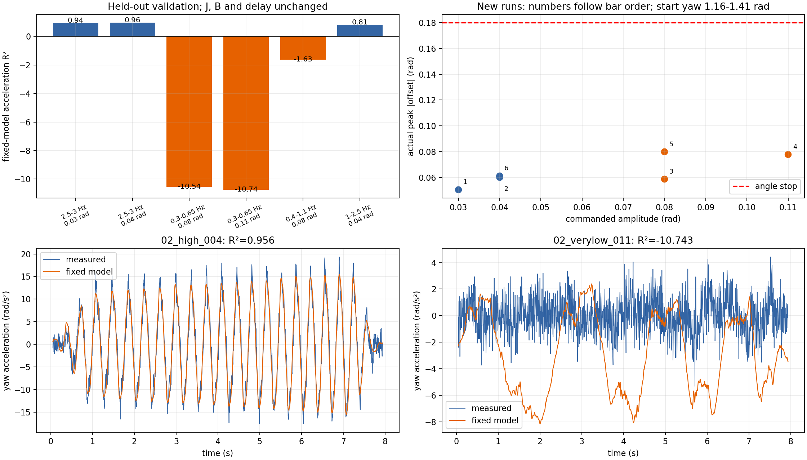

# C 车 yaw 模型频率范围扩展验证

日期：2026-10-02。承接[上一轮大幅度扫频报告](../large_chirp_validation_2026-10-02/report.md)。此次在现有测试程序允许的 **0.3–3.0 Hz** 全频率边界内，新增 6 轮 8 秒扫频、47,997 行原始 CSV。全部完整结束。0.18 rad 角度、1.2 rad/s 速度、3 N·m 命令力矩及遥控使能保护保持原样。

## 验证设置

仍使用原直接力矩辨识模型：

\[
G_{\tau\to\theta}(s)=\frac{e^{-0.003s}}{0.14261165s^2+1.37854785s}.
\]

固定 \(J\)、\(B\) 与 3 ms 延迟；每轮仅利用最初 1 秒估计单个常值扰动力矩，然后用后续数据计算**加速度留出集** \(R^2\)。模型输入为实测电机力矩，实际加速度从云台与底盘 IMU 相对角速度求导。扫频命令本身由模型前馈加弱位置/速度校正产生，因而这不是纯开环实验；结果评价的是该闭环实验记录下的模型解释能力。

新 6 轮的起始编码器角为 **1.16–1.41 rad**，而上轮主要参考记录的起始角约 **2.59–2.61 rad**。位置变化可能影响摩擦、线缆拉力或其他偏置；不能把跨两轮的分数差全部归因于频率。即便新 6 轮之间，起始位置也不完全一致。

## 原始结果

| 扫频范围 | 目标幅度 | 起始 yaw | 实际最大起点偏移 | 最大实测转速 | 最大命令力矩 | 固定模型 \(R^2\) |
|---|---:|---:|---:|---:|---:|---:|
| 2.5–3.0 Hz | 0.03 rad | 1.398 rad | 0.0504 rad | 0.611 rad/s | 1.946 N·m | **0.940** |
| 2.5–3.0 Hz | 0.04 rad | 1.408 rad | 0.0600 rad | 0.862 rad/s | 2.559 N·m | **0.956** |
| 0.3–0.65 Hz | 0.08 rad | 1.381 rad | 0.0587 rad | 0.239 rad/s | 0.980 N·m | **−10.538** |
| 0.3–0.65 Hz | 0.11 rad | 1.415 rad | 0.0778 rad | 0.356 rad/s | 0.931 N·m | **−10.743** |
| 0.4–1.1 Hz | 0.08 rad | 1.214 rad | 0.0799 rad | 0.550 rad/s | 1.031 N·m | **−1.633** |
| 1.0–2.5 Hz | 0.04 rad | 1.164 rad | 0.0611 rad | 0.660 rad/s | 1.748 N·m | **0.810** |

分频段看，2.5–3.0 Hz 的 0.04 rad 测试在 2.5–2.75 和 2.75–3.0 Hz 均为 \(R^2\approx0.956\)。1.0–2.5 Hz 测试的 1.0–1.5、1.5–2.0、2.0–2.5 Hz 子区间分别为 **−0.179、0.775、0.915**。0.3–0.65 Hz 两个幅度下，各子频段分数均为负。

## 判断与限制

1. **高频小幅运动的模型验证范围已扩展到 3.0 Hz。** 2.5–3.0 Hz 两轮的留出集分数分别为 0.940 和 0.956，且运动未触及保护。但只验证了 0.03–0.04 rad 目标幅度，不能推广到该频段更大的运动。
2. **低频不能直接沿用原线性二阶模型。** 在 0.3–0.65 Hz 两个幅度下，实测加速度均方根约 1.3 rad/s²，模型预测约 4.1–4.4 rad/s²，明显高估。即使用整段数据事后调整一个最有利的常值扰动力矩，\(R^2\) 仍为 −4.62 和 −4.89。加速度数值求导的噪声会放大低速时的 \(R^2\) 波动，但编码器与 IMU 相对速度的相关系数分别为 0.966、0.987；当前结果不能只用一个传感器失真解释。
3. **过渡区需要谨慎。** 1.0–2.5 Hz 整体分数 0.810，但其中 1.0–1.5 Hz 子区间仍为负。可把约 1.5 Hz 以上作为下一步重点验证区间，而不把它宣称为严格的物理分界。

这些结果不证明机器人惯量 \(J\) 或粘性阻尼 \(B\) 因 PID/前馈调整而改变，也不能直接锁定低频误差的原因。静摩擦、速度死区、线缆/位置相关力矩、底盘微动和力矩估计偏差均需进一步分离。建议下一步在**同一个明确固定的起始 yaw 角**重复 0.3–0.65、0.4–1.1、1.0–2.5 Hz 的小幅测试，并记录正反向力矩与速度；据独立记录评估是否需要加入库仑摩擦/死区项。

## 文件与机器人状态

- [2.5–3.0 Hz 原始记录及协议](../chirp_extended_high_2026-10-02/)、[0.3–0.65 Hz 原始记录及协议](../chirp_extended_low_2026-10-02/)、[中间频段原始记录及协议](../chirp_bridge_2026-10-02/)。
- [逐轮指标 CSV](run_metrics.csv)、[完整分析 JSON](summary.json)、[分析脚本](../analyze_extended_chirp.py)、[测试脚本](../run_large_chirp_validation.py)。
- 第一次高频部署因 YAML 把 `3.0` 写为整数 `3` 导致执行器启动检查失败，**该次没有触发运动**；其协议记录保存在 [`chirp_extended_high_preflight_failed_2026-10-02`](../chirp_extended_high_preflight_failed_2026-10-02/)。修正数值类型后完成上述测试。
- 每批测试结束均自动恢复原程序和 C 车配置。最终独立复核：机器人 `alliance-hero` 的库 SHA-256 为 `2a046d42b9b5b389691688ffe89263a221e82579e9ac425ccf015f51d7431b3c`，C 车配置 SHA-256 为 `dbebe05ddf4e44affb619e5a39b7a7c84a1af3abc927d8cc27614e49e08c3666`，C 车执行器正在运行。
