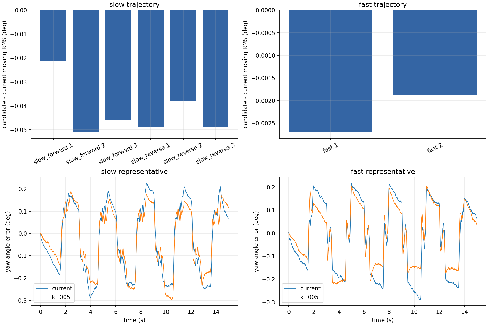

# C 车 yaw 低速跟踪优化：速度环积分 A/B

日期：2026-10-02。基于[扩展频率验证](../extended_chirp_validation_2026-10-02/report.md)发现的低速二阶模型残差，本轮只调整 C 车 yaw 速度环积分系数 `yaw_velocity_ki`。惯量、阻尼前馈、其他 PID 参数及共用控制器源码均未改动。

## 候选与方法

| 参数 | 当前组 | 候选组 |
|---|---:|---:|
| yaw 角度 Kp | 12 | 12 |
| yaw 速度 Kp | 11 | 11 |
| **yaw 速度 Ki** | **0.02** | **0.05** |
| yaw 速度积分限幅 | ±5 | ±5 |
| 速度/加速度前馈 B、J | 1.378547846、0.142611646 | 相同 |

积分计算器每次更新累加速度误差，积分状态限幅 ±5；候选的最大积分力矩贡献从 0.10 N·m 变为 0.25 N·m。该改动是控制器调优，不意味着被控对象的 \(J\)、\(B\) 发生变化。低频扫频残余力矩曾显示方向相关项，但同时存在位置变化，尚不足以直接加入一个固定的摩擦前馈量。

低速 A/B 使用同一条 ±0.08 rad、每相 1.5 s、转动 1.0 s 的五次多项式轨迹，共 12 轮。先做 `当前→候选` 三对，再做 `候选→当前` 三对，以检查运行顺序和 yaw 位置缓慢变化的影响。较快轨迹使用原先 ±0.10 rad、转动 0.5 s 的设置，顺序为 `当前→候选→候选→当前`，共 4 轮。每轮约 15 s，全部通过遥控门控、角度、转速和力矩检查；同一批次不同运行的目标轨迹最大差异分别为 0.00090、0.00119 和 0.00156 rad。

## 测试结果

| 指标 | 低速当前 | 低速 Ki=0.05 | 变化 | 较快当前 | 较快 Ki=0.05 | 变化 |
|---|---:|---:|---:|---:|---:|---:|
| 转动阶段角误差 RMS | 0.1730° | **0.1307°** | **−24.4%** | 0.0867° | 0.0844° | −2.6% |
| 每次换向绝对误差积分 IAE | 0.002712 rad·s | **0.002073 rad·s** | **−23.6%** | 0.000528 rad·s | 0.000545 rad·s | +3.2% |
| 保持阶段角误差 RMS | 0.2599° | **0.1929°** | **−25.8%** | 0.2054° | 0.1666° | −18.9% |
| 反馈力矩绝对值 P99 | 1.038 N·m | 1.056 N·m | +1.8% | 1.427 N·m | 1.382 N·m | −3.2% |
| 最高绝对角速度 | 0.335 rad/s | 0.336 rad/s | +0.3% | 0.790 rad/s | 0.792 rad/s | +0.3% |
| 控制器命令力矩峰值 | 1.277 N·m | 1.304 N·m | +2.1% | 1.787 N·m | 1.655 N·m | −7.4% |

低速六对的候选减当前转动 RMS 差值依次为 **−0.0211、−0.0510、−0.0461、−0.0487、−0.0380、−0.0487°**；每对的 IAE 也降低。反转顺序后仍保持相同方向，支持这是一项可重复的低速改善。较快轨迹仅有两对：RMS 略低、IAE 略高，幅度小；目前不能断言较快运动同样获益，也不能排除很小的退化。全部运行中未触发 4 N·m 命令限幅。

## 结论与适用范围

**选用 `yaw_velocity_ki: 0.05`。** 在本轮受控轨迹和工作位置附近，它使低速转动误差与保持误差稳定下降，力矩增加较小；较快轨迹未显示明显的 RMS 或峰值退化。测试期间起始 yaw 角持续变化，交错和反序测试减轻了顺序影响，但尚不能替代不同固定角度与日常遥控/自瞄目标的验证。当前优化不修复低频二阶模型本身的失配；若后续要加入摩擦或位置相关前馈，应另做独立拟合与 A/B 验证。

## 部署与数据

- 本轮只修改 C 车配置文件 [`deformable-infantry-omni-c.yaml`](../../../rmcs_ws/src/rmcs_bringup/config/deformable-infantry-omni-c.yaml) 的 `yaw_velocity_ki: 0.05`；其他车型及共用控制器源码未改动。本地此前已有的 C 车扫频实验代码保留。
- 机器人 `alliance-hero` 已部署这一项参数变化。最终独立核对：C 车 YAML SHA-256 `f2e4048cd65ecf90c74828538e502616f62b0e3e0d3d558a35f99d9ed5ceca18`，库 SHA-256 `2a046d42b9b5b389691688ffe89263a221e82579e9ac425ccf015f51d7431b3c`，C 车执行器运行中。机器人配置仍使用原有 ±0.10 rad、0.5 s 的手动测试轨迹；低速轨迹仅临时用于 A/B。
- [低速当前先行 CSV](../low_speed_ki_ab_2026-10-02/)、[低速候选先行 CSV](../low_speed_ki_ab_reverse_2026-10-02/)、[较快轨迹 CSV](../fast_speed_ki_ab_2026-10-02/)、[逐轮指标](run_metrics.csv)、[完整汇总](summary.json)、[部署记录](deployment.json)。
- [测试脚本](../run_low_speed_ki_ab.py)、[分析脚本](../analyze_ki_optimization.py)、[部署脚本](../deploy_ki_optimization.py)。
