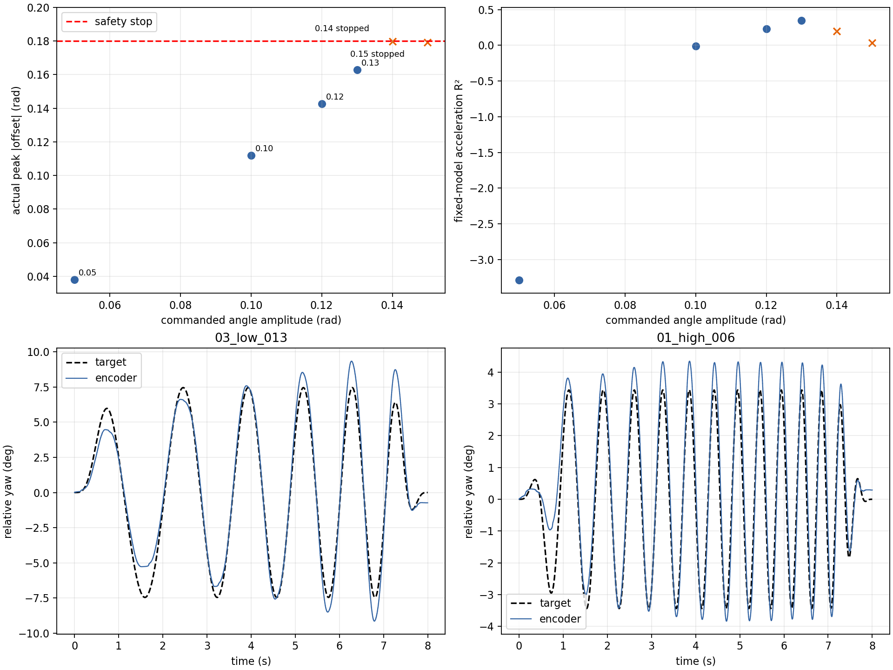
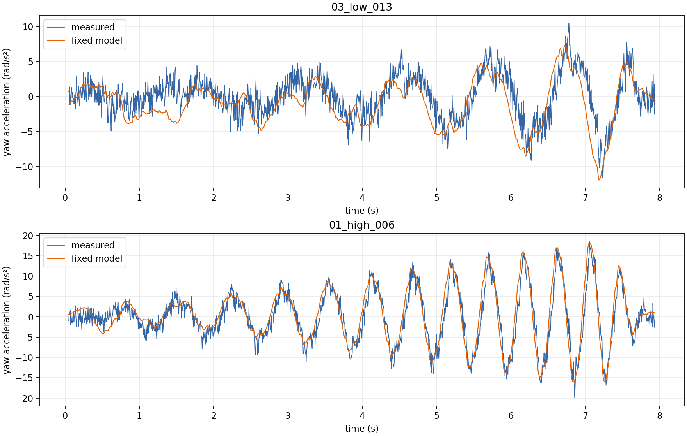

# C 车 yaw 大幅度扫频与二阶模型外推验证

日期：2026-10-02。测试对象：`deformable-infantry-omni-c` 云台 yaw，车体固定。本文只评价这次的工作位置、频率和运动范围，不把测试中的最大幅度当成机械极限。

## 目的与方法

验证先前通过直接力矩激励拟合的二阶模型，在更大幅度、不同频率的运动中是否仍能解释实际运动：

\[
G_{\tau\to\theta}(s)=\frac{e^{-0.003s}}{0.14261165s^2+1.37854785s}.
\]

输入是由电机电流换算的**实测输出力矩**，输出是相对底盘的 yaw 编码器角度；动力学验证使用云台与底盘 IMU 的相对角速度计算加速度。原模型的独立脉冲验证加速度 \(R^2=0.908\)，但该验证只覆盖较小角度与短时运动，详情见 [`yaw_plant_fit.json`](../yaw_plant_fit.json)。

新测试为 8 秒线性扫频，开始和结束各用 1 秒平滑包络。低频组 0.4–1.1 Hz，目标角幅度逐级增加；高频组 1.0–2.5 Hz。测试命令由原模型的速度/加速度前馈及弱位置/速度修正共同产生，并非纯开环。每轮从当时位置起算，角位移达到 0.18 rad、转速达到 1.2 rad/s、力矩达到 3 N·m 或遥控使能丢失时停止。7 轮共导出 51,361 行原始 CSV；5 轮完整结束、2 轮由角度保护提前终止。

验证时固定原模型 \(J=0.14261165\,\mathrm{kg\,m^2}\)、\(B=1.37854785\,\mathrm{N\,m\,s/rad}\) 和 3 ms 延迟。每轮仅用最初 1 秒估计一个常值扰动力矩，然后用其余数据计算加速度 \(R^2\)；因此没有用验证数据重新调整原模型。\(R^2=1\) 表示完美，0 表示与用该段平均加速度预测相当，负值表示更差。加速度由传感器数据数值求导，低信噪比时 \(R^2\) 尤其敏感。

## 逐轮结果

| 频率 / 目标幅度 | 完成 | 实测最大起点偏移 | 实测最大转速 | 固定模型加速度 \(R^2\) |
|---|---:|---:|---:|---:|
| 0.4–1.1 Hz / 0.05 rad | 是 | 0.0381 rad (2.18°) | 0.267 rad/s | −3.288 |
| 0.4–1.1 Hz / 0.10 rad | 是 | 0.1119 rad (6.41°) | 0.871 rad/s | −0.012 |
| 0.4–1.1 Hz / 0.12 rad | 是 | 0.1427 rad (8.17°) | 1.058 rad/s | 0.228 |
| 0.4–1.1 Hz / 0.13 rad | 是 | **0.1628 rad (9.33°)** | **1.150 rad/s** | **0.350** |
| 0.4–1.1 Hz / 0.14 rad | 否，6.25 s 角度保护 | 0.1797 rad (10.29°) | 1.105 rad/s | 0.196* |
| 0.4–1.1 Hz / 0.15 rad | 否，5.10 s 角度保护 | 0.1793 rad (10.27°) | 1.059 rad/s | 0.036* |
| 1.0–2.5 Hz / 0.06 rad | 是 | 0.0758 rad (4.35°) | 1.096 rad/s | **0.863** |

\* 提前停止的记录只统计停止前的数据，不能代表完整 8 秒扫频。在此设置下，**0.13 rad 是实测完整结束的最大目标幅度**；该轮整个编码器角度跨度为 18.46°。目标幅度不是实际角度上限：0.14 和 0.15 rad 的测试都已接近 0.18 rad 保护阈值，因此停止继续加幅。完整原始数值见 [`run_metrics.csv`](run_metrics.csv) 与 [`summary.json`](summary.json)。

## 对模型的判断

- **1.0–2.5 Hz：**在这轮 0.06 rad 目标幅度下，固定模型对留出数据的加速度 \(R^2=0.863\)；分频段为 0.734、0.861、0.878。它能较好解释这一较快运动范围的短时加速度。
- **0.4–1.1 Hz：**即使 0.13 rad 的完整测试，整体 \(R^2\) 也只有 0.350；其中 0.4–0.65 Hz 为 −1.069、0.65–0.9 Hz 为 0.412、0.9–1.1 Hz 为 0.499。大幅度测试揭示了慢速范围的明显模型残差，不能据原先的脉冲结果宣称此二阶模型覆盖全部运动范围。
- 对 0.13 rad 的低频记录，即使用**整段验证数据事后选择**一个最有利的常值扰动力矩，\(R^2\) 也只到 0.463。这说明“每轮一个固定偏置”不足以解释全部误差。0.05 rad 轮的负 \(R^2\) 也受运动幅度小、信噪比较低影响，不能单凭它判断参数改变。

这些数据**不能证明物理惯量或粘性阻尼在调 PID、加前馈后发生了变化**。本轮使用模型前馈和弱闭环修正，且较大运动可能引入摩擦、线缆拉力、位置依赖负载、底盘微动或传感器/力矩估计偏差。把新数据直接重拟合出另一组 \(J,B\)，只能得到此试验条件下的等效参数，不能据此判定真实物理参数变了。当前证据支持继续把原模型用于已验证的较快、小幅运动附近；低频、大行程预测应注明适用范围或扩展模型。

## 数据与复现

- [第一批原始 CSV、协议与清单](../large_chirp_2026-10-02/)；[第二批原始 CSV、协议与清单](../large_chirp_followup_2026-10-02/)。
- [测试与导出脚本](../run_large_chirp_validation.py)；[固定参数验证与制图脚本](../analyze_large_chirp_validation.py)。
- 机器人测试时临时部署的库和 C 车配置已恢复。2026-10-02 复核：库 SHA-256 为 `2a046d42b9b5b389691688ffe89263a221e82579e9ac425ccf015f51d7431b3c`，配置 SHA-256 为 `dbebe05ddf4e44affb619e5a39b7a7c84a1af3abc927d8cc27614e49e08c3666`，C 车执行器正在运行。本地仅 C 车源码/配置及本实验文件有改动，测试代码尚未作为常驻程序部署。

## 后续验证建议

若要扩大模型有效范围，可先针对 0.4–0.65 Hz、不同初始 yaw 位置做重复的受限幅度实验，记录双向运动和底盘 IMU；再比较包含库仑摩擦、死区或位置相关扰动力的模型。只有在独立记录上优于当前二阶模型，才采纳更复杂的模型。做新的大幅度或高频测试前应重新确定角度、速度保护边界；本次 0.14 rad 和 0.15 rad 已触发保护。
