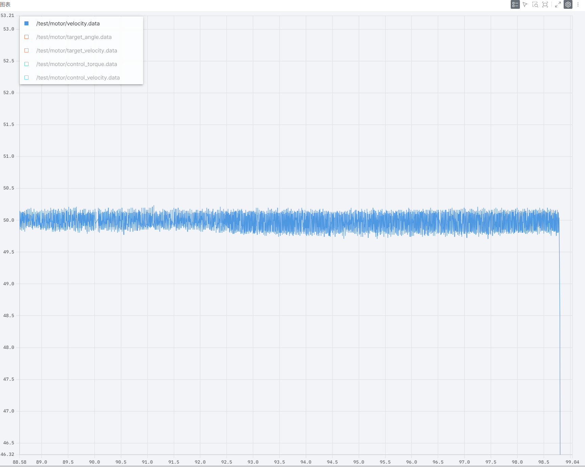
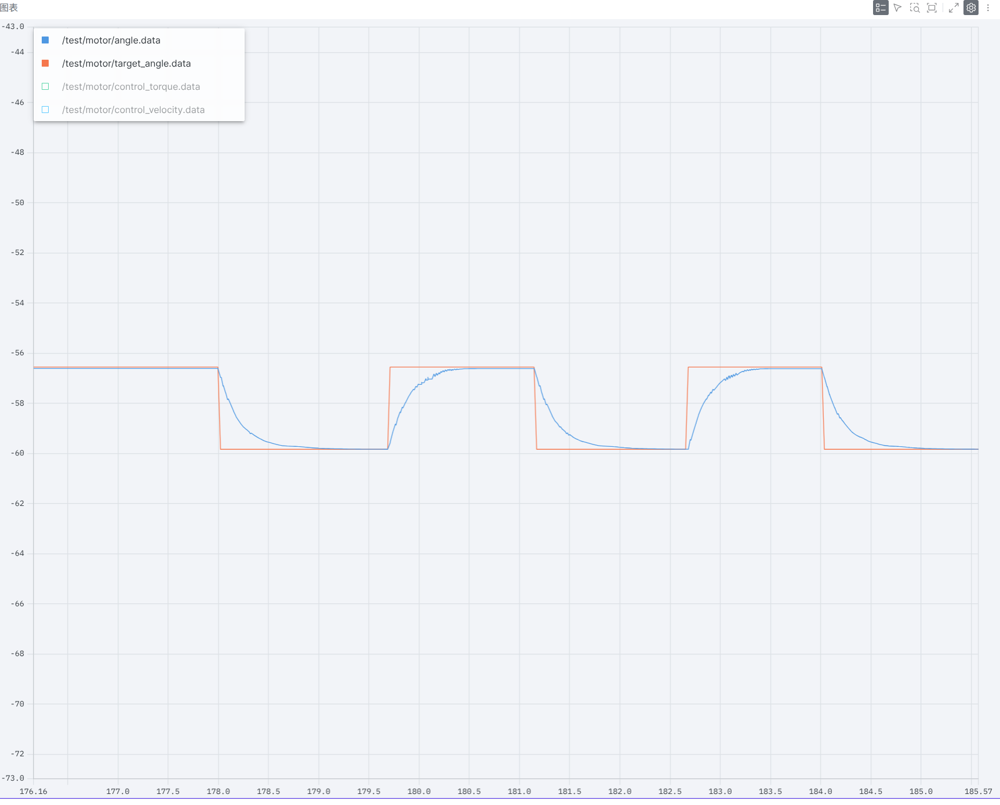

代码已上传github: 

## 第一题：飞书链接 https://fa4g5no1b1f.feishu.cn/docx/HSkld3B0xoUcDrxfYs9c3FEJnlw?blockId=doxcno0g4Bj3y7LI637iouNBThd&blockToken=CBkPwvJaDhNXfPbtxMDcKOWznee&blockType=whiteboard&doc_app_id=501&openbrd=1#doxcno0g4Bj3y7LI637iouNBThd

## 第二题：接入dr16控制单环M3508
采用遥控器左摇杆映射为电机速度
调试时波形如图（设定速度为50）：

## 第三题：设置角度值 用双环稳定
接入了dr16（左摇杆不在中心位置时转到设定角度，否则在初始设定角度）
调试时波形如图：

注：调试时有时会出现launch后剧烈振荡 我按着电机底座使它稳定后松手便恢复正常且运行顺滑 猜想可能是电机底座没固定导致
