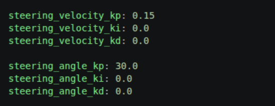
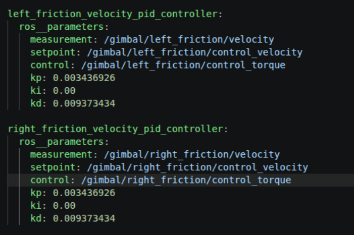
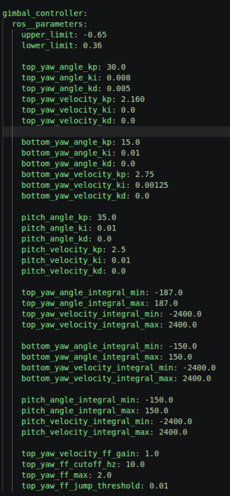
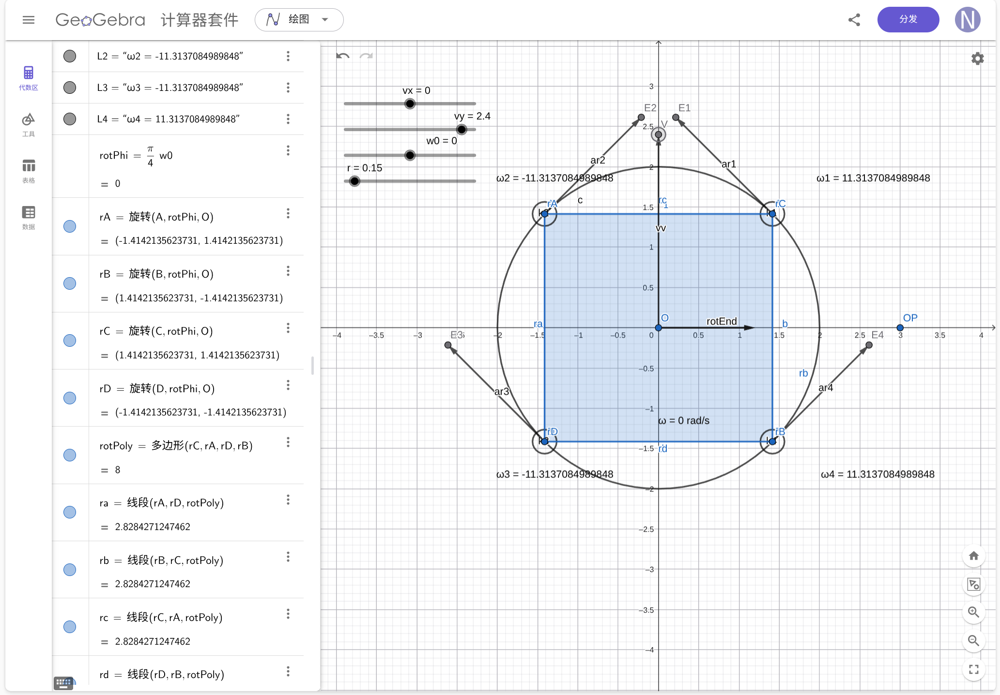
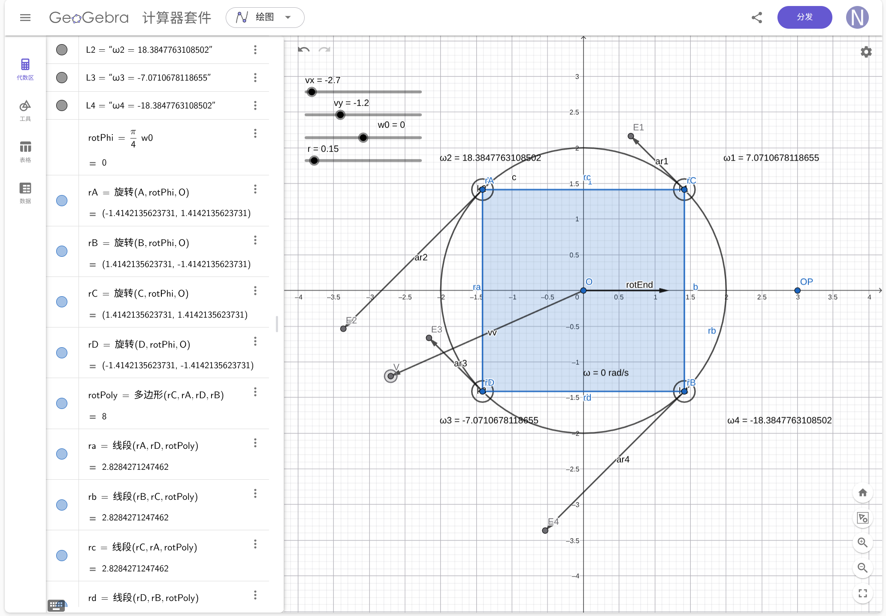
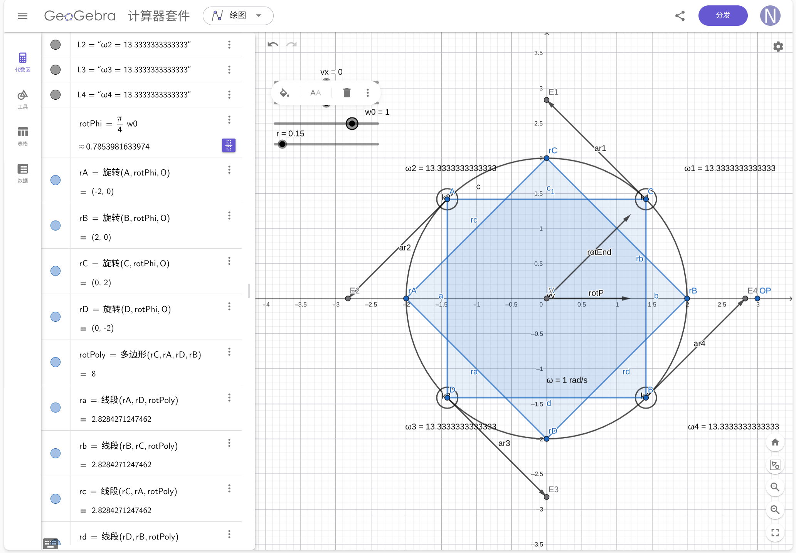
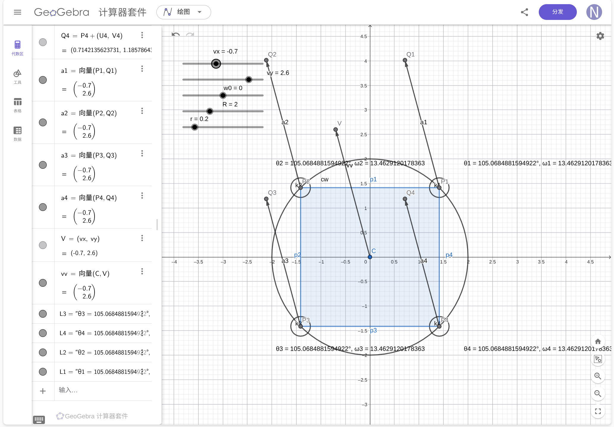
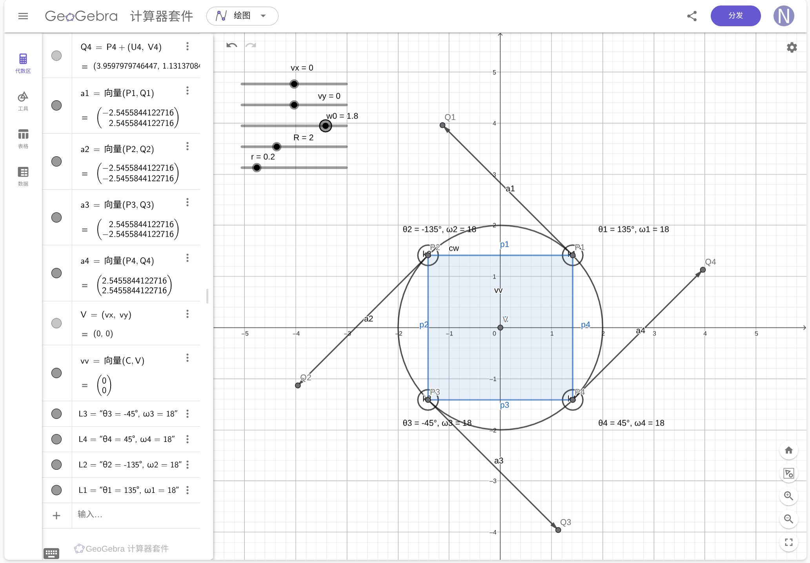
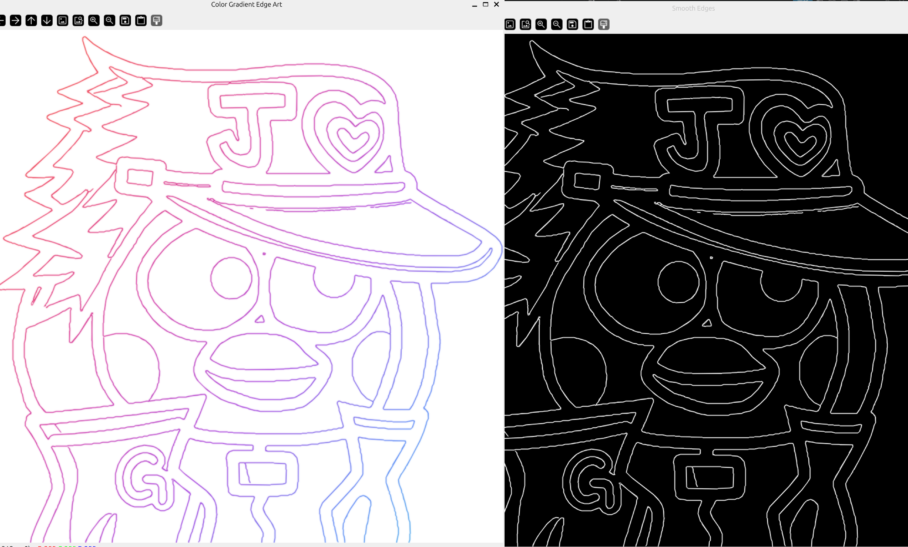
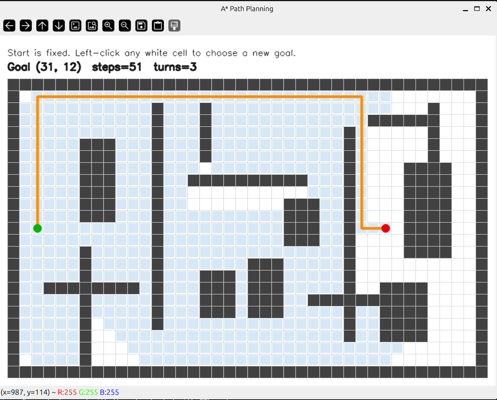

代码已上传仓库：(龙门架)https://github.com/N1N1N1no/RMCS
（视觉+导航）https://github.com/N1N1N1no/Week3
# 任务一 PID参数配合
## 舵轮底盘的舵轮舵向电机外环和内环
### 控制需求与期望效果
**1.方向变化快速到位，从当前值转到指定角度值时，要快速响应** 

**2.准确到达目标位置，不出现超调情况**

**3.到达目标位置后受到外力扰动可以快速回到目标位置并保持稳定**
### 速度环（内环）
**我认为应该采用PI控制。**
P保证基础调节能力，使电机能有力转动，同时可以提供阻尼和抗扰动的力。
I的作用是消除静态误差，克服静摩擦或者常值摩擦，如果没有明显的静态误差可以不加。
内环不加D是因为编码器速度反馈本身噪声比较大，D会把噪声放大转变为力矩，容易造成剧烈抖动。

### 位置环（外环）
**可以采用单P或PD控制。**
P是位置调节的核心，决定了角度响应的快慢。
可以加D是因为微分控制相当于提前制动，根据误差变化率作出调节，可以显著增加系统阻尼，减少振荡，抑制超调。但也可以不加是因为有内环速度环的调节，外环可以只使用P控制得到近似临界阻尼的响应。

**哨兵steering_wheel_controller参数**

## 控制摩擦轮转速
### 控制需求与期望效果
**1.摩擦轮电机按照设定速度值稳定转动，保证弹丸初速度一致。**

**2.有一定的抗干扰能力，在弹丸发射影响摩擦轮转速后迅速回到目标速度**
### 单速度环控制
**主要采用单P控制，可以加一点D**
P越大，抗干扰能力越强，可以在摩擦轮掉速的时候及时把速度拉回设定值。
可以加一点小D，在突然调速时误差变化率很大，D可以多给一点力矩防止掉速过大。
I不加是因为启动时目标差速比较大，I积分容易超调（虽然摩擦轮控制中有软启动防止超调）。如果要用的话要给积分限幅限制住。（但是我们队伍代码中好像基本不用I）

**无人机左右摩擦轮pid参数**

## 自瞄时云台控制
### 控制需求与期望效果
**1.自瞄时云台要及时响应，转到目标角度并保持稳定**

**2.低延时跟随运动目标**

**3.抗底盘或无人机自身姿态变化扰动**

**4.防止超调甩枪，切换目标时角度目标跳变可能有较大的变化，不能出现大幅超调情况**
### 速度环（内环）
**PI控制，D视情况而定**
P给力，I用于消除陀螺仪零偏和常值力矩（配合前馈，比如重力前馈），如果有比较明显的噪声可增加D给阻尼

### 角度环（外环）
**单P控制为主，ID看情况加“
I可能在目标改变时持续积分，造成超调，慎加，同时要配合积分限幅限制。对于D，视觉给出的角度本身带抖动，对误差微分会把抖动放大成枪口高频颤振。外环需要的阻尼应该来自内环速度环，而不是外环自己的 D，慎加。

**哨兵云台pid参数**

**与此同时，云台通常会加速度前馈帮忙控制：**

# 任务二 底盘运动解算

约定车体坐标系原点在底盘中心，$x$ 轴向前、$y$ 轴向左，偏航角速度 $\omega_z$ 逆时针为正。第 $i$ 个轮中心到车体中心的距离为 $R$，轮半径为 $r$。

## 全向轮

设第 $i$ 个轮的位置角为 $\phi_i$，有效滚动方向角为 $\alpha_i$，则目标角速度为

$$
\omega_{w_i}
=\frac{
v_x\cos\alpha_i+v_y\sin\alpha_i
+R\omega_z\sin(\alpha_i-\phi_i)
}{r}.
$$

若只考虑平动，则令 $\omega_z=0$：

$$
\omega_{w_i}
=\frac{v_x\cos\alpha_i+v_y\sin\alpha_i}{r}.
$$

四轮可取 $1$ 前轮沿 $+x$、$2$ 左轮沿 $+y$、$3$ 后轮沿 $+x$、$4$ 右轮沿 $+y$，最终公式为

$$
\begin{aligned}
\omega_{w_1}&=\frac{v_x-R\omega_z}{r},&
\omega_{w_2}&=\frac{v_y-R\omega_z}{r},\\
\omega_{w_3}&=\frac{v_x+R\omega_z}{r},&
\omega_{w_4}&=\frac{v_y+R\omega_z}{r}.
\end{aligned}
$$

### 可视化 
https://www.geogebra.org/calculator/mfxmedza
**平动效果图**

**转动效果图**

## 舵轮

第 $i$ 个舵轮轮心的合速度为

$$
\boldsymbol{v}_{w_i}
=
\begin{bmatrix}
v_x-R\omega_z\sin\phi_i\\docs/zh-cn/images/image-2.png docs/zh-cn/images/image (2).png
$$
\theta_i
=\operatorname{atan2}\left(v_{w_i,y},v_{w_i,x}\right),
$$

$$
\omega_{w_i}
=\frac{\left\lVert\boldsymbol{v}_{w_i}\right\rVert}{r}.
$$

### 可视化
https://www.geogebra.org/calculator/rb9c6vec
**平动效果图**

**转动效果图**

# 任务三 龙门架运动

## 一、方案

方案以电机协同控制为核心：左右 M2006 电机均采用角度环与速度环组成的双环控制，由同一条限制速度和加速度的平滑高度参考驱动，角度环负责定位，速度环提高动态响应和抗负载扰动能力；两侧再根据位置差进行交叉耦合同步，左高右低时降低左侧给定、提高右侧给定，同时加入重力与摩擦前馈补偿偏载，使龙门保持等高。机械上只使用导轨承受侧向力、丝杆消隙并采用一侧固定一侧浮动的安装方式，避免过约束影响电机控制。

## 二、传感器选择与无外部传感器时的估计

可以使用电机自带的多圈编码器测量两侧丝杆的位置和速度，并增加下限位开关用于上电找零。若要求更高，可增加绝对编码器直接测量平台位置；若平台会倾斜，可增加 IMU 测量 Roll/Pitch，其中 Roll 用于校验左右同步误差。

没有外部传感器时，以两侧电机多圈编码器为主：上电后先运动到同一下限位或已知机械零位并锁存，再根据两侧电机转角计算左右位移、平均高度和高度差。该方法可以满足同一通电周期内的同步控制，但会受丝杆回差、打滑和积分漂移影响，需要限位开关和堵转检测。

## 三、RMCS 实现

- 硬件组件：`rmcs_ws/src/rmcs_core/src/hardware/gantry_frame.cpp`。通过 C 板 CAN1 驱动左右 M2006 电机，读取多圈角度和角速度，并接入 DR16。
- 控制组件：`rmcs_ws/src/rmcs_core/src/controller/gantry_frame_controller.cpp`。完成平滑高度参考、共模/差模分解、交叉耦合同步和重力/摩擦前馈。
- 配置：`rmcs_ws/src/rmcs_bringup/config/gantry_frame.yaml`。每侧配置角度 PID 和速度 PID，并通过 `ValueBroadcaster` 输出高度、同步误差和电机反馈。
- 调试时先分别整定两侧闭环，再打开 `sync_enabled` 调节同步环。

# 任务四 视觉

## One Last Image 实现推测

从最终效果和 `show.cpp` 的实现来看，我猜测它不是直接套用某个现成滤镜，而是先提取图像轮廓，再给轮廓做渐变着色：先将图像灰度化并做双边滤波，在尽量保留边缘的同时去噪；然后用 Canny 检测边缘，并通过形态学闭运算连接断裂的轮廓；接着提取轮廓、用多边形拟合去除锯齿，将轮廓绘制到空白画布上。最后根据像素在画面中的斜向位置生成 $0\sim1$ 的插值参数，在红、粉、紫、蓝等颜色之间插值，把颜色赋给轮廓，并叠加轻微高斯光晕和抗锯齿，从而得到类似 One Last Image 的彩色线稿效果。

**效果图：**

# 任务五 导航规划

## 一、A* 算法实现

对应实现见 `navigation.cpp`。代码把栅格地图、A* 搜索和可视化分开设计：

- `GridMap` 用二维栅格表示地图，记录每个格子是否可通行，并提供边界检查和矩形障碍物填充。
- `AStarPlanner` 使用四邻域搜索；从起点到当前格子的代价为 $g$，曼哈顿距离作为启发函数 $h$，优先队列始终按 $f=g+h$ 取出代价最小的节点。
- 使用 `closed` 数组避免重复扩展，使用 `parent` 数组记录父节点，找到终点后反向恢复路径并再次反转，得到起点到终点的最短路径。
- 搜索同时记录路径代价、扩展节点数和访问过的格子；对起点等于终点、起点或终点不可达、地图尺寸非法等情况都做了处理。
- 使用 `Position`、`SearchResult` 等结构封装数据，并用 `const`、`[[nodiscard]]` 和独立的辅助函数提高代码可读性和安全性。

## 二、测试环境与可视化

程序启动后先运行自测，覆盖普通最短路径、起点等于终点和障碍物完全阻断三种情况。主程序使用一个 $40\times25$ 的栅格测试地图，包含边界墙体和多种矩形障碍，默认起点固定，用户可以左键点击任意白色格子改变终点。

OpenCV 可视化中用浅色标出搜索过程扩展过的节点，用橙色折线绘制最终路径，用绿色和红色圆点分别表示起点与终点，并在窗口顶部显示路径代价和扩展节点数。

**效果图be like：**

