# RoboMaster 第三周任务报告

> **代码仓库**
>
> - 龙门架：<https://github.com/N1N1N1no/RMCS>
> - 视觉与导航：<https://github.com/N1N1N1no/Week3>

## 任务一 PID 参数配合

### 1. 舵轮底盘舵向电机外环和内环

#### 控制需求与期望效果

1. 方向变化快速到位：从当前值转到指定角度值时，要快速响应。
2. 准确到达目标位置，不出现超调。
3. 到达目标位置后受到外力扰动，可以快速回到目标位置并保持稳定。

#### 速度环（内环）

采用 PI 控制。

- **P**：保证基础调节能力，使电机能有力转动，同时提供阻尼和抗扰动能力。
- **I**：消除静态误差，克服静摩擦或常值摩擦；如果没有明显的静态误差，可以不加。
- **D**：内环不加 D。编码器速度反馈本身的噪声较大，D 会将噪声放大并转化为力矩，容易造成剧烈抖动。

#### 位置环（外环）

可以采用单 P 或 PD 控制。

- **P**：位置调节的核心，决定角度响应的快慢。
- **D**：微分控制相当于提前制动，根据误差变化率进行调节，可以显著增加系统阻尼，减少振荡并抑制超调。
- 由于内环速度环已经提供调节作用，外环也可以只使用 P 控制，从而得到近似临界阻尼的响应。

#### 参数记录

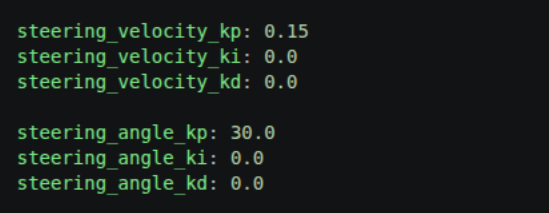

*图 1：哨兵舵向电机 PID 参数。*

### 2. 控制摩擦轮转速

#### 控制需求与期望效果

1. 摩擦轮电机按照设定速度值稳定转动，保证弹丸初速度一致。
2. 具备一定的抗干扰能力，在弹丸发射影响摩擦轮转速后迅速回到目标速度。

#### 单速度环控制

主要采用单 P 控制，可以加入少量 D。

- **P**：P 越大，抗干扰能力越强，可以在摩擦轮掉速时及时将速度拉回设定值。
- **D**：可以加入少量 D。突然调速时误差变化率较大，D 可以提供额外力矩，防止掉速过大。
- **I**：不建议加入 I。启动时目标差速较大，积分容易造成超调。如果使用 I，需要配合积分限幅。当前队伍代码中基本不使用 I。

#### 参数记录

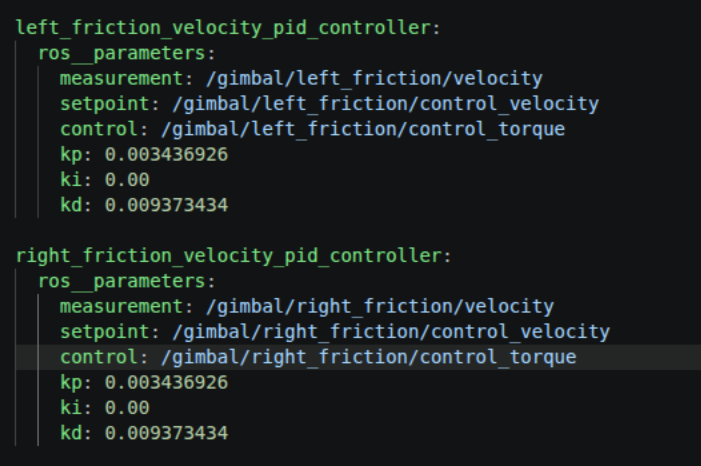

*图 2：无人机左右摩擦轮 PID 参数。*

### 3. 自瞄时的云台控制

#### 控制需求与期望效果

1. 自瞄时云台要及时响应，转到目标角度并保持稳定。
2. 低延时跟随运动目标。
3. 抵抗底盘或无人机自身姿态变化产生的扰动。
4. 防止超调甩枪。切换目标时角度目标可能发生跳变，不能出现大幅超调。

#### 速度环（内环）

采用 PI 控制，D 视情况而定。

- **P**：提供主要的调节能力。
- **I**：用于消除陀螺仪零偏和常值力矩，可配合前馈使用，例如重力前馈。
- **D**：如果噪声比较明显，可以增加 D 提供阻尼。

#### 角度环（外环）

以单 P 控制为主，I、D 视情况添加。

- **I**：目标改变时可能持续积分并造成超调，应谨慎使用，同时配合积分限幅。
- **D**：视觉给出的角度本身带有抖动，对误差进行微分会将抖动放大为枪口高频颤振，应谨慎使用。
- 外环所需的阻尼应主要来自内环速度环，而不是外环自身的 D。

#### 参数记录

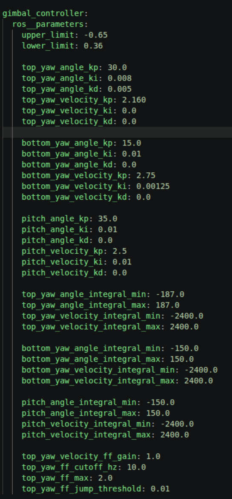

*图 3：哨兵云台 PID 参数。*

云台通常还会加入速度前馈辅助控制：

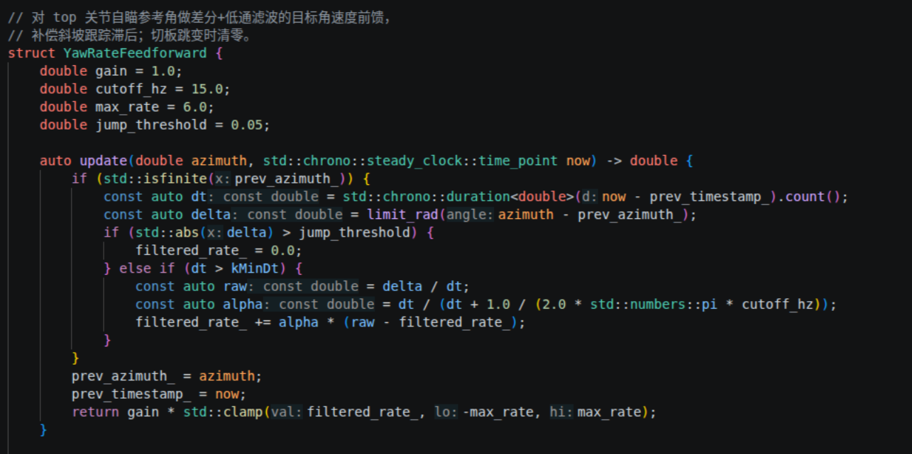

*图 4：云台速度前馈示意。*

## 任务二 底盘运动解算

约定车体坐标系原点位于底盘中心，$x$ 轴向前、$y$ 轴向左，偏航角速度 $\omega_z$ 逆时针为正。第 $i$ 个轮中心到车体中心的距离为 $R$，轮半径为 $r$。

### 1. 全向轮

设第 $i$ 个轮的位置角为 $\phi_i$，有效滚动方向角为 $\alpha_i$，则目标角速度为

$$
\omega_{w_i}
=
\frac{
v_x\cos\alpha_i+v_y\sin\alpha_i
+R\omega_z\sin(\alpha_i-\phi_i)
}{r}.
$$

若只考虑平动，则令 $\omega_z=0$：

$$
\omega_{w_i}
=
\frac{v_x\cos\alpha_i+v_y\sin\alpha_i}{r}.
$$

四轮可取 1 为前轮、沿 $+x$ 方向，2 为左轮、沿 $+y$ 方向，3 为后轮、沿 $+x$ 方向，4 为右轮、沿 $+y$ 方向。最终公式为

$$
\begin{aligned}
\omega_{w_1}&=\frac{v_x-R\omega_z}{r},&
\omega_{w_2}&=\frac{v_y-R\omega_z}{r},\\
\omega_{w_3}&=\frac{v_x+R\omega_z}{r},&
\omega_{w_4}&=\frac{v_y+R\omega_z}{r}.
\end{aligned}
$$

#### 可视化

[打开 GeoGebra 全向轮运动学演示](https://www.geogebra.org/calculator/mfxmedza)

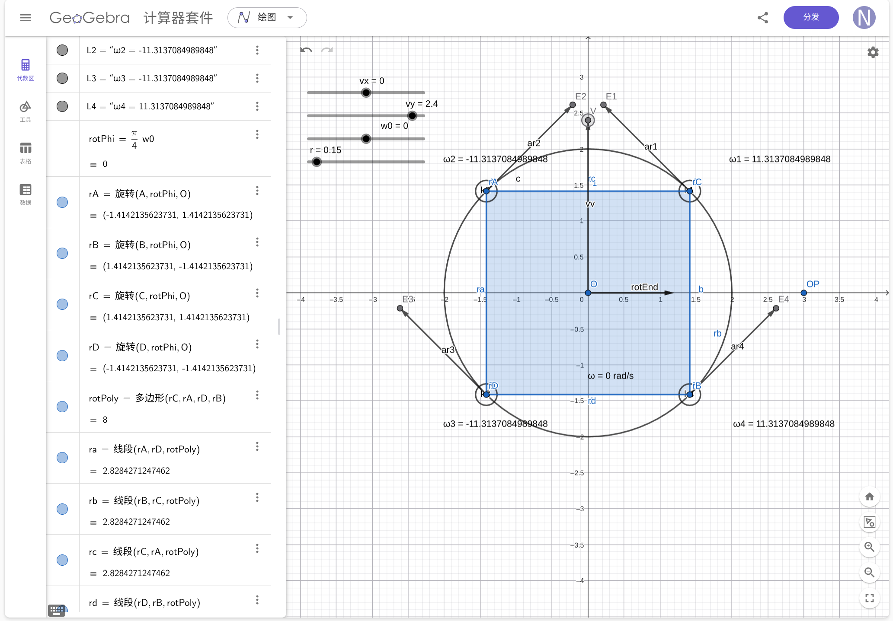

*图 5：全向轮平动效果图 1。*

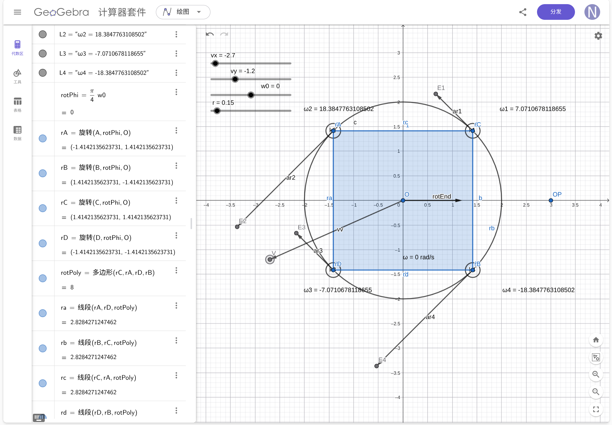

*图 6：全向轮平动效果图 2。*

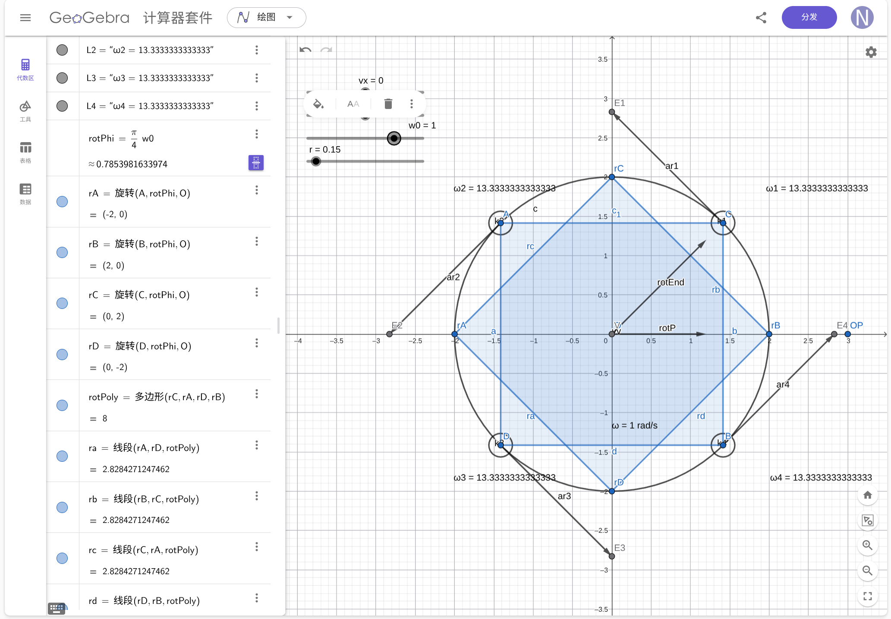

*图 7：全向轮转动效果图。*

### 2. 舵轮

第 $i$ 个舵轮轮心的合速度为

$$
\boldsymbol{v}_{w_i}
=
\begin{bmatrix}
v_x-R\omega_z\sin\phi_i\\
v_y+R\omega_z\cos\phi_i
\end{bmatrix}.
$$

目标转角和目标角速度分别为

$$
\theta_i
=\operatorname{arctan2}\left(v_{w_i,y},v_{w_i,x}\right),
$$

$$
\omega_{w_i}
=\frac{\left\lVert\boldsymbol{v}_{w_i}\right\rVert}{r}.
$$

#### 可视化

[打开 GeoGebra 舵轮运动学演示](https://www.geogebra.org/calculator/rb9c6vec)

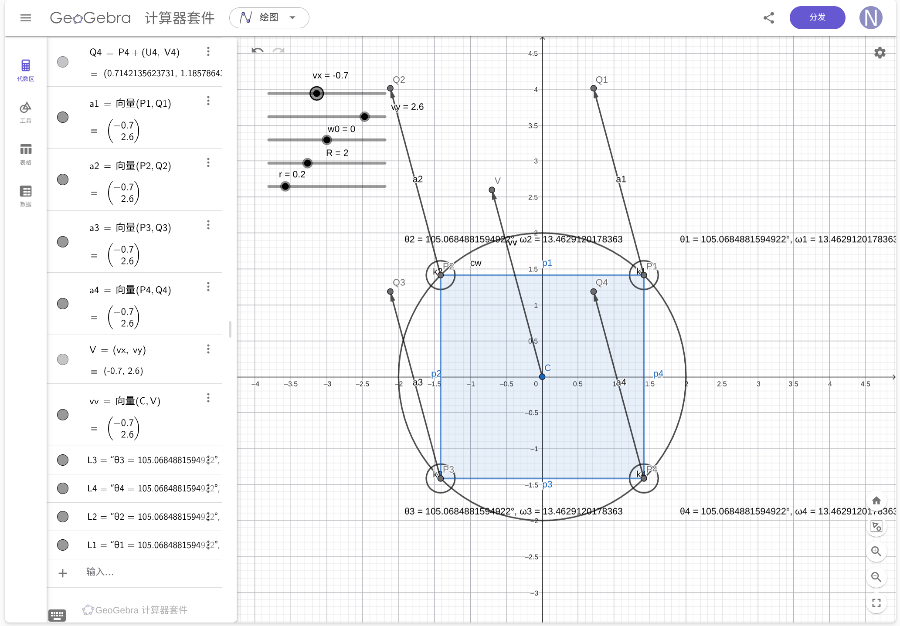

*图 8：舵轮平动效果图。*

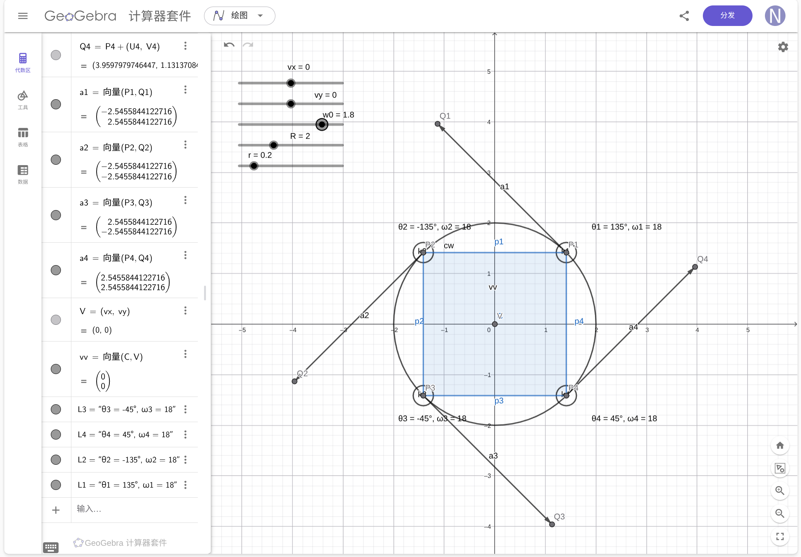

*图 9：舵轮转动效果图。*

## 任务三 龙门架运动

### 一、方案

方案以电机协同控制为核心：左右 M2006 电机均采用角度环与速度环组成的双环控制，由同一条限制速度和加速度的平滑高度参考驱动。角度环负责定位，速度环提高动态响应和抗负载扰动能力；两侧再根据位置差进行交叉耦合同步，左高右低时降低左侧给定、提高右侧给定，同时加入重力与摩擦前馈补偿偏载，使龙门保持等高。机械上只使用导轨承受侧向力、丝杆消隙，并采用一侧固定、一侧浮动的安装方式，避免过约束影响电机控制。

### 二、传感器选择与无外部传感器时的估计

可以使用电机自带的多圈编码器测量两侧丝杆的位置和速度，并增加下限位开关用于上电找零。若要求更高，可增加绝对编码器直接测量平台位置；若平台会倾斜，可增加 IMU 测量 Roll/Pitch，其中 Roll 用于校验左右同步误差。

没有外部传感器时，以两侧电机多圈编码器为主：上电后先运动到同一下限位或已知机械零位并锁存，再根据两侧电机转角计算左右位移、平均高度和高度差。该方法可以满足同一通电周期内的同步控制，但会受丝杆回差、打滑和积分漂移影响，需要限位开关和堵转检测。

### 三、RMCS 实现

- **硬件组件**：`rmcs_ws/src/rmcs_core/src/hardware/gantry_frame.cpp`。通过 C 板 CAN1 驱动左右 M2006 电机，读取多圈角度和角速度，并接入 DR16。
- **控制组件**：`rmcs_ws/src/rmcs_core/src/controller/gantry_frame_controller.cpp`。完成平滑高度参考、共模/差模分解、交叉耦合同步和重力/摩擦前馈。
- **配置**：`rmcs_ws/src/rmcs_bringup/config/gantry_frame.yaml`。每侧配置角度 PID 和速度 PID，并通过 `ValueBroadcaster` 输出高度、同步误差和电机反馈。
- **调试步骤**：先分别整定两侧闭环，再打开 `sync_enabled` 调节同步环。

## 任务四 视觉

### One Last Image 实现推测

从最终效果和 `show.cpp` 的实现来看，它不是直接套用某个现成滤镜，而是先提取图像轮廓，再为轮廓进行渐变着色：

1. 将图像灰度化并进行双边滤波，在尽量保留边缘的同时去噪。
2. 使用 Canny 检测边缘，并通过形态学闭运算连接断裂的轮廓。
3. 提取轮廓并使用多边形拟合去除锯齿，再将轮廓绘制到空白画布上。
4. 根据像素在画面中的斜向位置生成 $0\sim1$ 的插值参数，在红、粉、紫、蓝等颜色之间插值，并将颜色赋给轮廓。
5. 叠加轻微高斯光晕和抗锯齿，得到类似 One Last Image 的彩色线稿效果。

#### 效果图

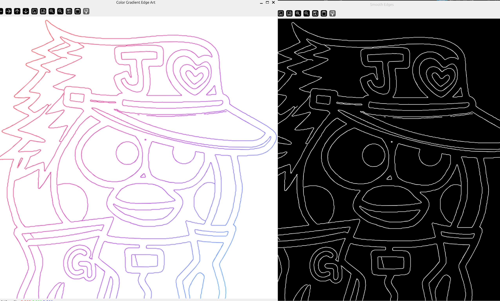

*图 10：One Last Image 彩色线稿效果。*

## 任务五 导航规划

### 一、A* 算法实现

对应实现见 `navigation.cpp`。代码将栅格地图、A* 搜索和可视化分开设计：

- `GridMap` 使用二维栅格表示地图，记录每个格子是否可通行，并提供边界检查和矩形障碍物填充。
- `AStarPlanner` 使用四邻域搜索。从起点到当前格子的代价为 $g$，曼哈顿距离作为启发函数 $h$，优先队列始终按 $f=g+h$ 取出代价最小的节点。
- 使用 `closed` 数组避免重复扩展，使用 `parent` 数组记录父节点。找到终点后反向恢复路径并再次反转，得到起点到终点的最短路径。
- 搜索同时记录路径代价、扩展节点数和访问过的格子；对起点等于终点、起点或终点不可达、地图尺寸非法等情况都进行了处理。
- 使用 `Position`、`SearchResult` 等结构封装数据，并使用 `const`、`[[nodiscard]]` 和独立的辅助函数提高代码可读性和安全性。

### 二、测试环境与可视化

程序启动后先运行自测，覆盖普通最短路径、起点等于终点和障碍物完全阻断三种情况。主程序使用一个 $40\times25$ 的栅格测试地图，包含边界墙体和多种矩形障碍。默认起点固定，用户可以左键点击任意白色格子改变终点。

OpenCV 可视化中使用浅色标出搜索过程扩展过的节点，使用橙色折线绘制最终路径，使用绿色和红色圆点分别表示起点与终点，并在窗口顶部显示路径代价和扩展节点数。

#### 效果图

*图 11：A* 路径搜索结果 1。*

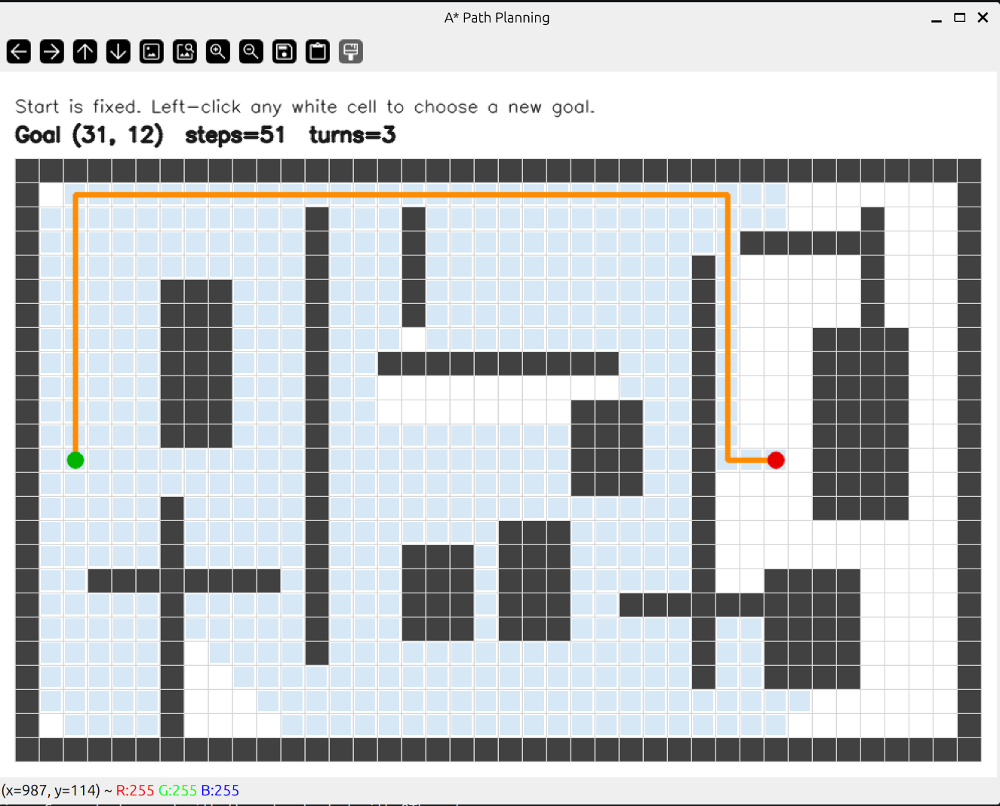

*图 12：A* 路径搜索结果 2。*
